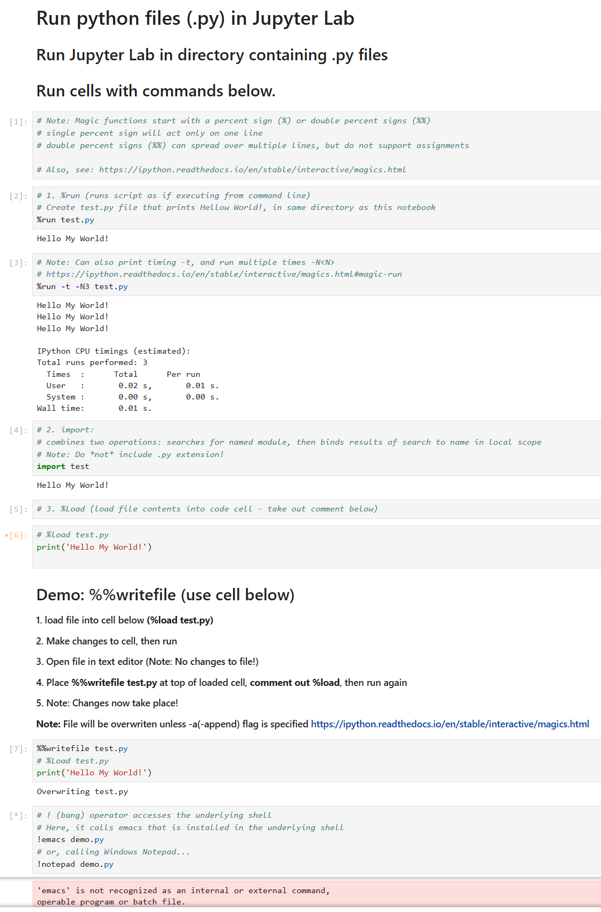

# LIS4376 - Artificial Intelligence Applications

## Mark Trombly

### Assignment 1 Requirements:

*Four Parts:*

1. Distributed Version Control with Git and Bitbucket.
2. Development installations.
3. Questions.
4. Bitbucket repo (main) link. 

#### README.md file should include the following items:

* Screenshot of a1_paycheck_calculator application running
* Links to A1 .ipynb files:
    * <a href="https://github.com/monstermark3d/lis4376/blob/master/a1/paycheck_calculator.ipynb" target="_blank">paycheck_calculator.ipynb</a> 
    * <a href="https://github.com/monstermark3d/lis4376/blob/master/a1/run_py_files_in_jupyter_lab.ipynb" target="_blank">run_py_files_in_jupyter_lab.ipynb</a>
    * <a href="https://github.com/monstermark3d/lis4376/blob/master/a1/magic_commands.ipynb" target="_blank">magic_commands.ipynb</a>
* git commands w/short descriptions

#### Git commands w/short descriptions:

1. git init - Create an empty Git repository or reinitialize an existing one
2. git status - Show the working tree status
3. git add - Add file contents to the index
4. git commit - Record changes to the repository
5. git push - Update remote refs along with associated objects
6. git pull - Fetch from and integrate with another repository or a local branch
7. git clone - Clone a repository into a new directory

#### Assignment Screenshots:

*Screenshot of paycheck calculator running (IDLE)*:

*Screenshot Paycheck Calculator (Visual Studio Code)*:

*Screenshot of Paycheck Calculator (Jupyter Notebook)*:

*Screenshot of Run Py Files (Jupyter Notebook)*:

*Screenshot of Magic Commands (Jupyter Notebook)*:

#### Repository Links:

*Bitbucket Repository*
[Bitbucket Repository Link](https://bitbucket.org/marktrombly/lis4376/src/master/ "Bitbucket Repository Link")