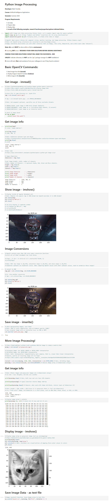

# LIS4376 - Artificial Intelligence Applications

## Mark Trombly

### Assignment 5 Requirements:

*Four Parts:*

1. Jupiter Lab A5 app.
2. Link to A5.ipynb file.
3. SkillSets (13 - 15).
4. Bitbucket repo (main) link. 

#### README.md file should include the following items:

* Predictive Analysis (Multiple Linear Regression)
* Provide screenshot of completed A5 app.
* Screenshot of skillset 13.
* Screenshot of skillset 14.
* Screenshot of skillset 15.
* Bitbucket repository link.

#### Assignment Screenshots:

*Screenshot A5 Completed App*:

[Assignment 5.ipynb](https://github.com/monstermark3d/lis4376/blob/master/a5/a5.ipynb "Assignment 5 ipynb")

*Screenshot skillset 13 :*

*Link to Skillset 13 code:*

[Skillset 13 Code Folder](/skillsets/s13_/ "S13 ")

[Skillset 13 Main](/skillsets/s13_/main.py "S13 main.py")

[Skillset 13 Functions](/skillsets/s13_/functions.py "S13 functions.py")

*Screenshot skillset 14 Python Image Processing:*

*Link to Skillset 14 ipynb:*

[Skillset 14 ipynb](https://https://github.com/monstermark3d/lis4376/blob/master/skillsets/s14_python_image_processing/s_14_image_processing_.ipynb "S14 Python Image Processing ipynb")

*Screenshot skillset 15 Python Image Processing2:*

*Link to Skillset 15 code:*

[Skillset 15 Code Folder](/skillsets/s15_python_image_processing2/ "S15 Python Image Processing2 ")

[Skillset 15 Main](/skillsets/s15_python_image_processing2/main.py "S15 Python Image Processing2 main.py")

[Skillset 15 Functions](/skillsets/s15_python_image_processing2/functions.py "S15 Python Image Processing2  functions.py")

#### Repository Links:

*Bitbucket Repository*
[Bitbucket Repository Link](https://bitbucket.org/marktrombly/lis4376/src/master/ "Bitbucket Repository Link")