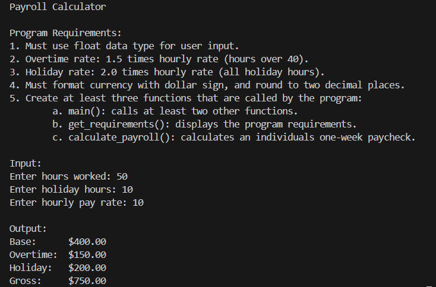

# LIS4376 - Artificial Intelligence Applications

## Mark Trombly

### Project 2 Requirements:

*Four Parts:*

1. Jupiter Lab P2 app.
2. Link to P2.ipynb file.
3. In-Class Debugging Exercise screenshot.
4. Bitbucket repo (main) link. 

#### README.md file should include the following items:

* Deep Learning: Image Classification.
* Provide screenshot of completed P2 app.
* Provide screenshot of In-Class Debugging Exercise app.
* Bitbucket repository link.

#### Assignment Screenshots:

*Screenshot P2 Completed App*:

[Project2.ipynb](https://github.com/monstermark3d/lis4376/blob/master/p2/p2.ipynb "Project 2 ipynb")

*Screenshot In-Class Debugging Exercise*:

*Link to In-Class Debugging Exercisce code:*

[In-Class Debugging Exercise Code Files](debug_exercise/ "In-Class Debugging Exercise Files")

[In-Class Debugging Exercise Main](debug_exercise/main.py "In-Class Debugging Exercise main.py")

[In-Class Debugging Exercise Functions](debug_exercise/functions.py "In-Class Debugging Exercise functions.py")

#### Repository Links:

*Bitbucket Repository*
[Bitbucket Repository Link](https://bitbucket.org/marktrombly/lis4376/src/master/ "Bitbucket Repository Link")